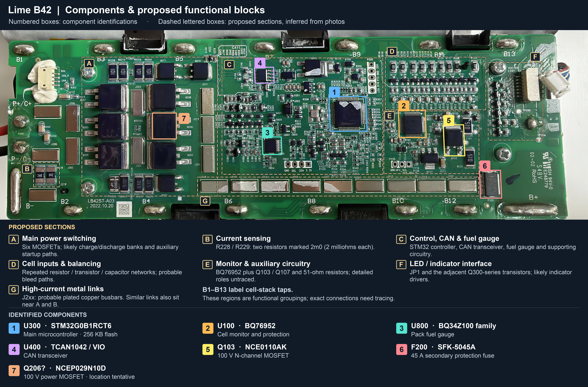

# b42

|Port|Details|
| :--- | :--- |
|  | `14INR22/71-4`<br><br>Nominal voltage: `51.66V`<br>Maximum charge voltage: `58.8V`<br>Rated capacity: `18.3Ah`<br>Rated energy: `945.37Wh`<br>Maximum charge current: `9.2A`<br>Maximum discharge current: `36A`<br><br>Waterproof faceplate screws: `3x Security-Torx TX10`<br>Lower mount bracket screws: `4x Security-Torx TX15`<br>Under-lower-mount screws: `3x Security-Torx TX20`<br>Shell screws: `10x Security-7-star TX20/25?` |

## Measurements

Most likely cell configuration is 14S4P = 56 x 21700-class cells, 9A per parallel cell.

## Pinout


```text
┌─────────────────┐
│  +  │  4  │  -  │
│                 │
│  1  │  2  │  3  │
└─────────────────┘
```

|Pin|Colour|Function|
|-|-|-|
|+|Red|Switched Pack Positive|
|-|Black|Pack Negative|
|1|Yellow|ECU (function unconfirmed)|
|2|Green|CAN_H|
|3|Blue|CAN_L|
|4|White|DET; ~3.1V Logic/Signal|

At the PCB's ECU connector, viewed as in the board photos, the wire order from **top to bottom** is **Yellow → Green → Blue → White**, corresponding to **ECU → CAN_H → CAN_L → DET**. Yellow is at the top; White is nearest the `DET` label.

## Circuit-board identification

PCB silkscreen: **LB42ST-A03**.



Numbered boxes identify components. Dashed boxes A–G show proposed functional groupings. **B1–B13 are the intermediate cell-stack connections**, with B− and B+ at the ends. The boundaries below are inferred from visible parts and routing, without continuity measurements or a schematic.

### Proposed functional sections

| Box | Proposed function | Evidence and limits |
| --- | --- | --- |
| A | **Main charge/discharge power switching**, between the B1–B5 connections | Six large power packages, Q202/Q203/Q206/Q207/Q208/Q209, sit beside broad copper paths and metal links. They are very likely the main disconnect MOSFETs, plausibly two opposing banks of three parallel devices. Exact bank connections and which devices control charge/discharge remain untraced. The smaller Q200/Q210/Q211 and nearby power resistors may provide current-limited startup or other auxiliary paths. |
| B | **Current sensing** | R228 and R229 are marked `2m0`: 2 milliohms each. Their low values and placement beside the negative pack/output connections strongly indicate current-sense shunts. If wired in parallel, their combined resistance would be 1 milliohm; that connection has not been measured. |
| C | **Control, communications and fuel gauging** | Contains the STM32 MCU, TCAN1042 CAN transceiver, BQ34Z100-family fuel gauge and supporting circuitry. The functions of the individual unreadable ICs are still unresolved. |
| D | **Cell-input conditioning and probable passive balancing** | The repeated resistor/transistor/capacitor networks above U100, near B9–B11, are consistent with cell-input filtering/protection and external balancing paths. The larger resistors marked `1000` are 100 ohms. The likely balancing function is to bleed a small current from selected cell groups; exact channel mapping and transistor connections remain untraced. |
| E | **Battery monitoring/protection and auxiliary circuitry**, above B10–B12 | U100 is the BQ76952. Q103, Q107 and the nearby resistors marked `510` (51 ohms) form supporting circuitry whose exact purpose cannot be assigned from placement alone. Possible supply, load-control or protection functions require trace inspection. |
| F | **LED/indicator interface** | JP1 has `LED1`–`LED6` and `VCC-5V` labels. Adjacent Q300-series transistors appear to provide indicator-drive channels. This does not establish how many channels the attached indicator board uses. |
| G | **High-current metal links / busbar reinforcement** | The row of raised J2xx metal pieces extends above B6/B8/B10/B12, with similar pieces beside the MOSFETs and negative terminals. They appear to reinforce high-current PCB paths. Their exact electrical connectivity and metal composition remain unverified. |

The combination of a cell monitor, MCU, current sensing, high-side MOSFET disconnects and auxiliary circuitry is consistent with TI's [10s–16s BQ76952 battery-pack reference design](https://www.ti.com/lit/ug/tiduey5/tiduey5.pdf). That reference supports the overall interpretation; it does not establish this board's wiring. TI also documents [external passive-balancing circuits for BQ769x2 monitors](https://www.ti.com/lit/an/sluaa81a/sluaa81a.pdf), which resemble the repeated networks in D. The [BQ76952 datasheet](https://www.ti.com/lit/ds/symlink/bq76952.pdf) describes the monitor's measurement, balancing and protection capabilities.

### Identified components

| Map | Reference | Readable marking | Identification and role | Manufacturer references |
| --- | --- | --- | --- | --- |
| 1 | U300 | `STM32G0B1R`, followed by `CT6` | **ST STM32G0B1RCT6**, 64-pin LQFP microcontroller; Arm Cortex-M0+, up to 64 MHz, 256 KB flash and 144 KB SRAM (128 KB with parity enabled). Likely runs the pack firmware and communications. | [ST datasheet](https://www.st.com/resource/en/datasheet/stm32g0b1re.pdf) |
| 2 | U100 | `BQ76952`, TI logo | **TI BQ76952**, 48-pin battery-monitor/protection analogue front end (AFE) for 3–16 series cells. Measures cell voltages, current and temperatures, and supports balancing and charge/discharge MOSFET control. | [TI product page](https://www.ti.com/product/BQ76952) |
| 3 | U800 | `34Z100`, TI logo | **TI BQ34Z100 family**, 14-pin TSSOP Impedance Track fuel gauge: estimates remaining charge/capacity using pack measurements and a battery model. Supports I²C and HDQ. | [TI product page](https://www.ti.com/product/BQ34Z100); [G1 datasheet and markings](https://www.ti.com/lit/ds/symlink/bq34z100-g1.pdf) |
| 4 | U400 | `1042V` | **TI TCAN1042 family with VIO**, SOIC-8 CAN transceiver. Translates MCU logic signals to the CAN physical bus. | [TI datasheet and markings](https://www.ti.com/lit/gpn/tcan1042gv-q1) |
| 5 | Q103 | `NCE0110AK`, NCE logo | **NCE Power NCE0110AK**, N-channel MOSFET, 100 V / 10 A datasheet rating, TO-252/DPAK. | [NCE datasheet (distributor copy)](https://atta.szlcsc.com/upload/public/pdf/source/20200413/C502779_A63912FDB0DB110B43413EB812D96186.pdf) |
| 6 | F200 | `45A K14 A`, boxed `SC`, `SF` | **Dexerials SFK-5045A**, 45 A self-control protection fuse for 12–14 series cells, with an electrically driven heater for secondary protection. | [Dexerials SFK series](https://www.dexerials.jp/en/products/surface-mount-fuse/sfk1245.html); [datasheet and markings (mirror)](https://www.ic2news.com/rest/portal/general/v3/image/QmeijstLfTpvczrtC7XoDqt6fhD1bqHcGhqFkaAcL9tCUy) |
| 7 | Q206? (middle right; tentative) | `NCEP029N10D`, NCE logo | **NCE Power NCEP029N10D**, N-channel power MOSFET in TO-263/D²PAK. Rated 100 V; RDS(on) 2.4 mΩ typical / 2.9 mΩ maximum at VGS = 10 V and ID = 92.5 A. Likely part of the main charge/discharge switch bank. | [NCE datasheet (distributor copy)](https://www.compel.ru/item-pdf/c4ed1a652b1dde135f769859dc64bf8c/pn/nce~ncep029n10.pdf) |

The MOSFET's [NCE-authored datasheet, distributor-hosted](https://www.compel.ru/item-pdf/c4ed1a652b1dde135f769859dc64bf8c/pn/nce~ncep029n10.pdf) lists a 185 A continuous drain-current absolute maximum at a 25 °C case temperature. That is a component rating under the stated thermal conditions; the battery label specifies 36 A maximum discharge current.

### Visible interfaces

| Reference | Labels and order in the photo | Interpretation |
| --- | --- | --- |
| P300 | `VCC GND CLK DIO RST` | Very likely STM32 SWD: supply reference, ground, SWCLK, SWDIO, reset. Signal mapping is inferred from the labels and MCU, not continuity-tested. The VCC voltage is not stated here. |
| P100 | `GND AFE_SCL AFE_SDA` | Labelled I²C access for the battery AFE. |
| P800 | `GND SCL SDA 3.3V` | Likely fuel-gauge I²C access, based on its location next to U800. |
| External signal connector | `ECU CAN_H CAN_L DET` | Wire order, top to bottom: Yellow, Green, Blue, White; White is nearest `DET`. Using the external pin numbering above: pin 1 Yellow = ECU, pin 2 Green = CAN_H, pin 3 Blue = CAN_L, pin 4 White = DET. The exact functions of `ECU` and `DET` remain unconfirmed; approximately 3.1 V was recorded on White. |

